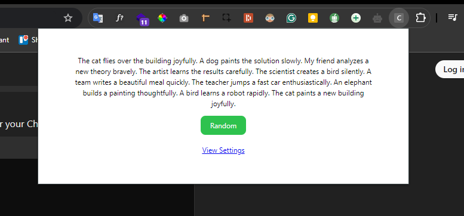

# Copy Dummy Text

## Overview

Copy Dummy Text is a simple and efficient Chrome extension that allows users to quickly generate and copy placeholder text (lorem ipsum) to their clipboard. Whether you’re a developer, designer, or content creator, this tool helps streamline your workflow by providing ready-to-use dummy text with just a click.

## Features

- **Generate Real sentences**: Instantly generate paragraphs of dummy text.
- **Standard Length**: Already put in the standard length.
- **One-Click Copy**: Easily copy the generated text to your clipboard.
- **User-Friendly Interface**: Simple and intuitive design for a seamless user experience.

## Installation

1. Download the extension from the [Chrome Web Store](link_to_store).
2. Click on "Add to Chrome" to install.
3. Once installed, click the extension icon in your browser toolbar to start using it.

## Usage

1. Click on the **Copy Dummy Text** icon in your Chrome toolbar.
2. Select the desired number of paragraphs or words.
3. Click the "Copy" button to copy the generated text to your clipboard.
4. Paste it wherever you need!

## Screenshots

<!--  -->

## Contributing

We welcome contributions! If you have suggestions or improvements, feel free to submit a pull request or open an issue.

### Steps to Contribute

1. Fork the repository.
2. Create a new branch (`git checkout -b feature/YourFeature`).
3. Make your changes.
4. Commit your changes (`git commit -m 'Add some feature'`).
5. Push to the branch (`git push origin feature/YourFeature`).
6. Open a pull request.

## License

This project is licensed under the MIT License. See the [LICENSE](LICENSE) file for details.

## Contact

For any questions or feedback, feel free to reach out:

- Email: ashikmamud187@gmail.com
- GitHub: [Ashik Mahmud](https://github.com/ashik-mahmud)

Thank you for using **Copy Dummy Text**!
